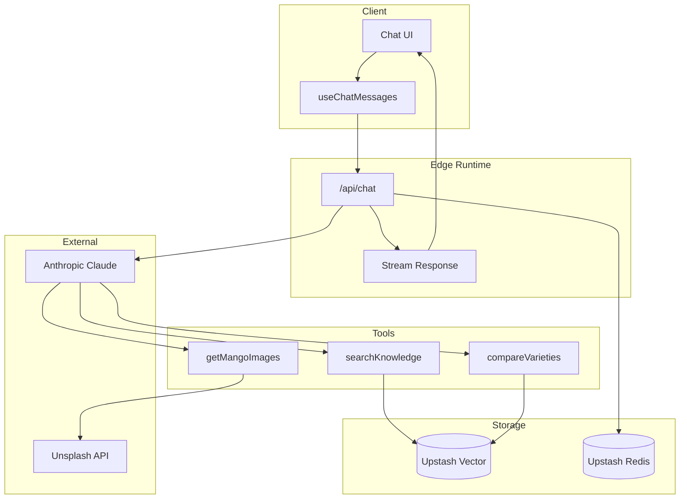

# Mango Expert

AI-powered chatbot specialized in Brazilian mangos. Built with RAG (Retrieval-Augmented Generation) for accurate, citation-backed responses about varieties, seasons, nutrition, exports, and cultivation.

## Demo:
- https://screen.studio/share/R1xsVWos
- https://mango.avenza.cloud/

## Capabilities

| Category | Feature | Description |
|----------|---------|-------------|
| **Knowledge** | RAG Search | Semantic search across 5 curated knowledge domains |
| | Varieties | Tommy Atkins, Palmer, Haden, Kent, Keitt, Rosa, Espada, and more |
| | Nutrition | Vitamins, minerals, health benefits, serving sizes |
| | Seasons | Harvest calendars, peak periods, regional timing |
| | Exports | Trade statistics, destinations, market data |
| | Cultivation | Growing regions, techniques, climate requirements |
| **Tools** | Image Search | Fetches high-quality mango images from Unsplash |
| | Variety Comparison | Side-by-side comparison of 2-4 mango varieties |
| | Citation Validation | Anti-hallucination checks ensure sources are real |
| **Chat** | Session Persistence | Conversations saved and restored across refreshes |
| | Multi-language | Responds in the same language as the user |
| | Streaming | Real-time token streaming for responsive UX |
| **Infrastructure** | Rate Limiting | Prevents abuse via Redis-backed middleware |
| | Edge Runtime | Low-latency responses via Vercel Edge |

## Technology Stack

| Layer | Technology | Rationale |
|-------|------------|-----------|
| Framework | Next.js 16 (App Router) | Edge runtime, streaming, file-based routing |
| UI | React 19 + Tailwind 4 | Server components, concurrent rendering |
| AI | Anthropic Claude | Best reasoning, tool use, instruction following |
| AI SDK | Vercel AI SDK | Native streaming, multi-step tool execution |
| Vector DB | Upstash Vector | Serverless, no cold starts, semantic search |
| Cache | Upstash Redis | Session storage, rate limiting, serverless |
| Images | Unsplash API | High-quality, properly licensed images |
| Validation | Zod | Runtime type safety for tool inputs |

## Architecture



### Data Flow

1. User sends message via `ChatInput`
2. `useChatMessages` hook sends to `/api/chat` (Edge)
3. Claude processes with available tools:
   - `searchKnowledge` → Upstash Vector (RAG)
   - `getMangoImages` → Unsplash API
   - `compareVarieties` → Multiple vector searches
4. Response streams back with citations
5. Session saved to Redis
6. UI updates in real-time

### Project Structure

```
src/
├── app/                  # Next.js routes + API (edge)
├── components/
│   ├── chat/             # Chat feature (components + hooks)
│   └── ui/               # Reusable primitives (shadcn/ui)
└── lib/
    ├── ai/               # Prompts, tools, validation
    ├── knowledge/        # Vector search + content
    ├── chat-history/     # Session persistence
    ├── db/               # Redis singleton
    └── types/            # Centralized type definitions
```

## Quick Start

```bash
npm install
cp .env.example .env.local  # Configure API keys
npm run seed                 # Seed knowledge base
npm run dev                  # Start dev server
``` 

See [docs/INSTALLATION.md](./docs/INSTALLATION.md) for detailed setup instructions.

## Documentation

- [docs/INSTALLATION.md](./docs/INSTALLATION.md) - Environment setup, API keys, deployment
- [docs/ARCHITECTURE.md](./docs/ARCHITECTURE.md) - Detailed architectural decisions and trade-offs

## License

MIT
