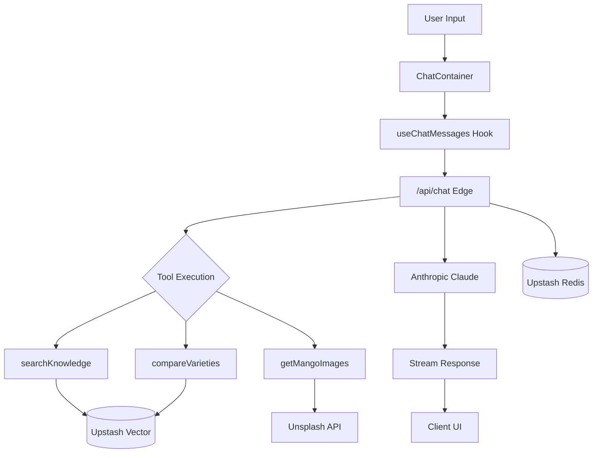

# Architecture Overview

Architectural decisions and patterns for the Mango Expert chatbot.

## Project Structure

```
src/
├── app/                          # Next.js App Router
│   ├── api/                      # API routes (edge runtime)
│   ├── globals.css               # Global styles + CSS variables
│   ├── layout.tsx                # Root layout with fonts
│   └── page.tsx                  # Main entry point
│
├── components/
│   ├── chat/                     # Feature: Chat interface
│   │   ├── hooks/                # Custom React hooks
│   │   ├── types.ts              # Re-exports from lib/types
│   │   ├── index.ts              # Barrel export
│   │   └── *.tsx                 # UI components
│   └── ui/                       # Reusable UI primitives (shadcn/ui)
│
├── lib/                          # Core business logic
│   ├── index.ts                  # Barrel export
│   ├── constants.ts              # Centralized constants
│   ├── utils.ts                  # Utility functions
│   ├── types/                    # Centralized type definitions
│   ├── db/                       # Database layer (Redis)
│   ├── api/                      # API response utilities
│   ├── ai/                       # AI configuration (prompts, tools, validation)
│   ├── chat-history/             # Chat session persistence
│   ├── knowledge/                # Vector search + content
│   └── images/                   # Image service (Unsplash)
│
└── proxy.ts                      # Rate limiting middleware
```

## Architectural Pattern

**Feature-Based Architecture** with centralized shared modules.

- **Why not Atomic Design?** Overkill for a single-feature app. Atomic Design shines in design systems with dozens of reusable components.
- **Why not full DI/Provider pattern?** See decision below.

## Key Decisions

### 1. Centralized Types

All shared types live in `lib/types/index.ts`.

**Rationale:**
- Single source of truth prevents type drift
- Easy to find and update type definitions
- Component-specific types can re-export

### 2. Singleton Services

Services like Redis and Vector DB are initialized as singletons.

**Rationale:**
- Prevents multiple connections in serverless environment
- Simple import pattern
- Sufficient for current scale

### 3. Centralized Constants

All magic numbers, TTLs, and configuration values in `lib/constants.ts`.

**Rationale:**
- No scattered magic strings
- Easy to audit and update values
- Type-safe with `as const`

### 4. API Error Utilities

Standardized error response helpers in `lib/api/errors.ts`.

**Rationale:**
- Consistent error format across all endpoints
- Reduces boilerplate in route handlers
- Centralized error handling logic

### 5. Custom Hooks for Complex Logic

Extract complex state logic into custom hooks (`components/chat/hooks/`).

**Rationale:**
- Components focus on rendering, hooks focus on logic
- Reusable across components if needed
- Easier to test in isolation

### 6. No Full Dependency Injection

Direct imports instead of DI container.

**Rationale:**
- Current app has single implementations (Upstash Redis, Upstash Vector, Anthropic)
- DI adds ~10+ files of abstraction overhead
- Next.js serverless model doesn't benefit much from traditional DI
- YAGNI (You Aren't Gonna Need It) for current scope

**Trade-off:** Switching providers requires editing implementation files directly.

**Future consideration:** If the app grows to need multiple providers, refactor to provider pattern:

```typescript
export interface ICacheProvider {
  get<T>(key: string): Promise<T | null>;
  set(key: string, value: unknown, options?: { ex?: number }): Promise<void>;
  del(key: string): Promise<void>;
}
```

## Data Flow



## Environment Dependencies

| Service | Provider | Purpose |
|---------|----------|---------|
| LLM | Anthropic Claude | Chat responses |
| Cache/Sessions | Upstash Redis | Chat history, rate limiting |
| Vector DB | Upstash Vector | Knowledge base search |
| Images | Unsplash | Mango images |

## Anti-Hallucination Strategy

The system uses multiple layers to prevent fabricated information:

1. **RAG-First Approach** - All factual queries use `searchKnowledge` tool
2. **Explicit Prompt Rules** - System prompt forbids inventing sources
3. **Citation Validation** - Dev-mode logging flags unverified URLs
4. **Source Attribution** - All facts must cite `sourceUrl` from tool results

## Testing Strategy

- **Unit tests:** Vitest for hooks and utilities
- **Component tests:** Testing Library for UI components
- **E2E:** Recommended: Playwright (not implemented)
